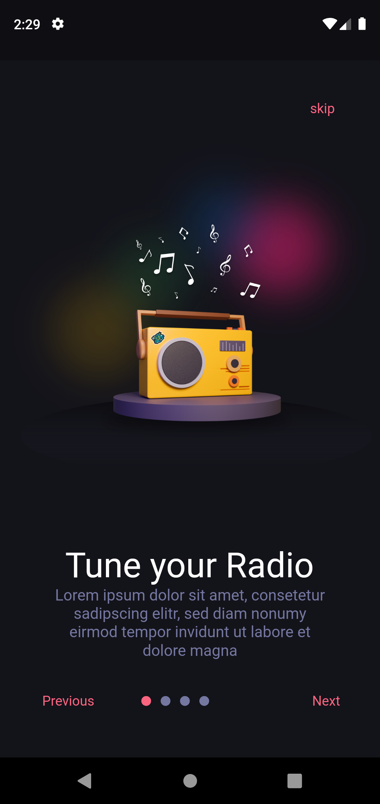
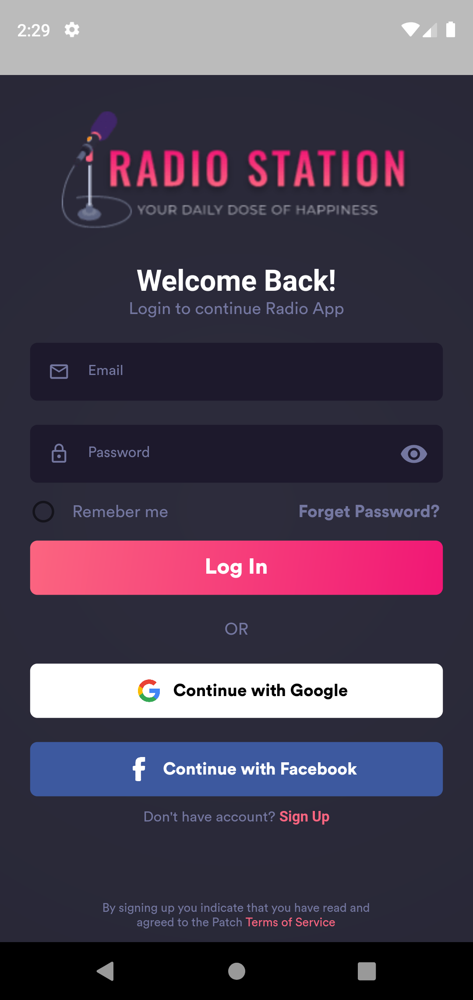
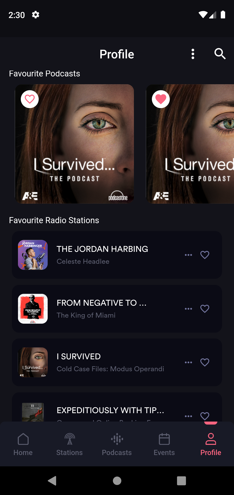
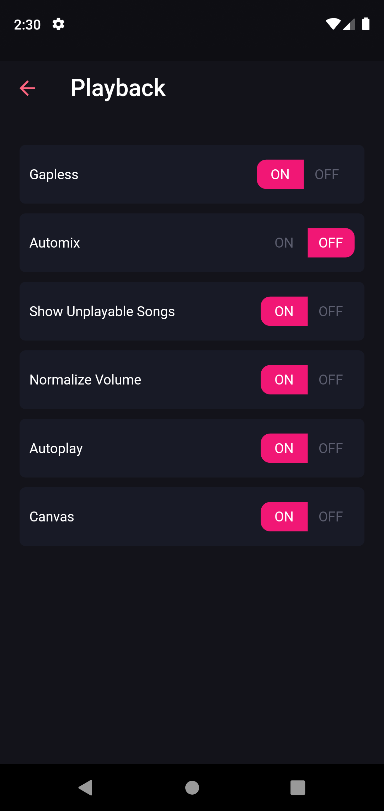
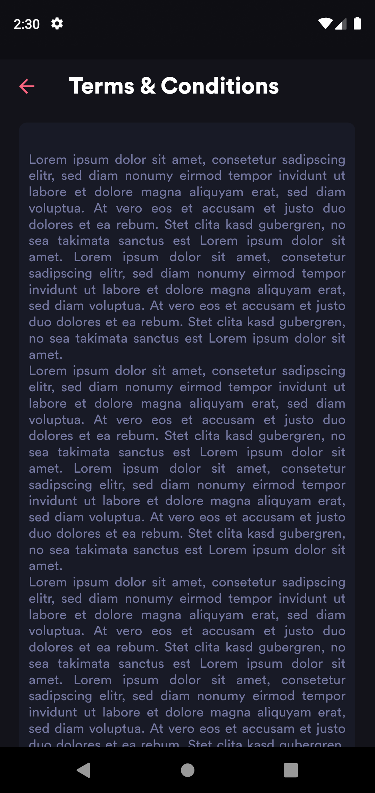

# Poddy Caster

A Flutter App which is available for both Android and iOS platform. It is a music player app which is able to play music from local storage as well as online. It is build by me and it's UI is completed. A few features are remaining to add further. The first version of the app is here.

## Getting Started

This project is a starting point for a Flutter application and this project is open for contributors to contrbute their work in this application.

A few resources to get you started if this is your first Flutter project:

- [Lab: Write your first Flutter app](https://docs.flutter.dev/get-started/codelab)
- [Cookbook: Useful Flutter samples](https://docs.flutter.dev/cookbook)

For help getting started with Flutter development, view the
[online documentation](https://docs.flutter.dev/), which offers tutorials,
samples, guidance on mobile development, and a full API reference.

## Screenshots

